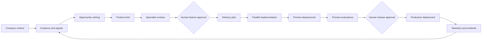
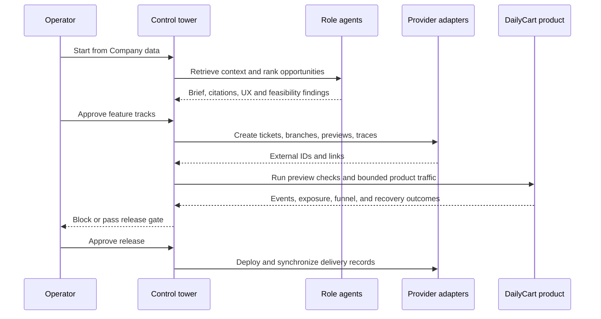

# DailyCart Delivery OS

DailyCart Delivery OS is an AI-first product delivery control tower. It turns a customer signal into an inspectable, governed release: discover evidence, choose an opportunity, shape the product brief, coordinate delivery, build a preview, evaluate it, obtain human approval, deploy, and learn from production feedback.

## Try the hosted demo

**[Open DailyCart Delivery OS](https://ai-delivery-evalops-control-tower-c.vercel.app)**

The hosted application is configured for live provider adapters. Browsing is read-only until the operator unlocks the session from the Demo Guide. The operator credential is intentionally kept out of source control and documentation; enter the private passcode supplied to the operator in the access panel.

The local equivalent is available at `http://localhost:3000` after starting the app, but the hosted link above is the canonical demo URL.

## What the product demonstrates

DailyCart is designed to teach and demonstrate how an AI-enabled delivery organization can work as one evidence-linked system:

- **Evidence-led product judgment** — customer interviews, support signals, analytics, incidents, and existing work become a versioned context pack.
- **Specialized AI collaboration** — research, product, UX, feasibility, delivery, engineering, evaluation, release, and incident roles contribute bounded outputs with citations.
- **Human governance** — feature and release decisions pause at explicit approval boundaries.
- **Traceable execution** — every meaningful output carries context, feature, run, skill, ticket, evaluation, approval, and deployment identifiers.
- **Quality as a release policy** — critical regressions block release even when an aggregate score looks acceptable.
- **Operational observability** — the same workflow is visible in the control tower and, when configured, in Slack, Linear, GitHub, Supabase, Langfuse, PostHog, Inngest, and Vercel.
- **Learning from outcomes** — bounded product traffic and incidents feed analytics and regression protection.

The customer and company records are synthetic and privacy-safe. Delivery execution, evaluations, approvals, provider calls, and deployment records are executable and are labeled clearly as live, deterministic fallback, or simulated.

## The mental model



The product is not a chat window pretending to be a delivery organization. It is a set of executable contracts: agents produce structured records, skills define how each role operates, evaluators measure outputs, and adapters make external actions visible.

## The end-to-end demo

1. Open **Company data** and inspect a context collection or evidence record.
2. Open **Overview** and follow the Demo Guide. Run the workflow from company context.
3. Review the two ranked feature opportunities and the evidence behind each recommendation.
4. Read the specialist review summaries, then approve the feature tracks.
5. Inspect the delivery roadmap, ownership, dependencies, and readiness checks.
6. Build the two product previews. Each track records its branch, commit, pull request, checks, and preview URL.
7. Run preview evaluations. A critical accessibility regression intentionally blocks the first campaign; the corrected campaign passes.
8. Approve the release, deploy both tracks, and sync delivery records.
9. Follow the identifiers across **Agent runs**, **Eval campaigns**, **Human review**, **Deployments**, **Integrations**, **Product**, and **Analytics**.
10. Use **Replay run** to archive the workflow artifacts and safely reset the scenario for another demonstration.



## Role model

| Role | Contribution | Visible result |
|---|---|---|
| Research and signal agents | Retrieve, cluster, and cite company evidence | Context pack and opportunity signals |
| PM | Synthesize the opportunity and product brief | Ranked recommendation and revision history |
| UX | Review clarity, accessibility, and interaction risks | Findings and acceptance criteria |
| Engineering feasibility | Map affected surfaces, dependencies, telemetry, and preview needs | Feasibility assessment |
| TPM | Turn approved scope into workstreams, owners, milestones, risks, and readiness | Delivery roadmap and ticket metadata |
| Engineering | Implement feature-flagged product changes and tests | Branch, commit, PR, checks, and preview |
| EvalOps | Run structural and semantic quality checks | Case results, scores, and release gate |
| Release | Coordinate approved production deployment | Deployment record and provider links |
| Incident | Convert production feedback into regression protection | Linked incident and eval case |

Each role is backed by a versioned executable skill definition. The UI shows concise reasoning summaries, citations, tool calls, latency, cost, and outputs; it does not expose private chain-of-thought.

## Where the integrations fit

| System | Purpose in the delivery story |
|---|---|
| Slack | Agent handoffs, approval requests, alerts, analytics summaries, questions, and commands |
| Linear | Roadmap, statuses, dependencies, ownership, acceptance criteria, and ticket history |
| GitHub | Branches, commits, pull requests, checks, and release references |
| Supabase | Durable workflow state, context records, and lineage edges |
| Langfuse | Traces, observations, scores, cost, and latency |
| PostHog | Product events, exposure, funnel, and adoption measurement |
| Inngest | Resumable workflow and phase events |
| Vercel | Preview and production deployment records |

The Integrations page shows each provider's mode, health, write capability, latest action, timestamp, and external link. A failed permission or unavailable provider is shown as a failure or fallback, never as a fabricated success.

## Slack control surface

One DailyCart bot represents the logical roles in shared threads. Configure the delivery, approvals, alerts, and analytics channel IDs to mirror the workflow across operational spaces. Supported commands include:

```text
/dailycart status
/dailycart run
/dailycart add-feature <description>
/dailycart ask <question>
/dailycart approve feature <feature-id>
/dailycart approve release <feature-id>
/dailycart create-ticket <description>
/dailycart replay
/dailycart reset
```

## Run locally in deterministic mode

```bash
corepack pnpm install
corepack pnpm demo
corepack pnpm dev
```

Open `http://localhost:3000`. This mode requires no credentials and still executes the workflow, persistence contracts, evaluators, approval pauses, lineage, and replay behavior with deterministic provider adapters.

## Connected mode and access control

For a deployment with provider side effects:

1. Set `INTEGRATION_MODE=live`.
2. Add provider secrets only through the deployment secret store.
3. Set a private `DAILYCART_OPERATOR_PASSCODE` in that store.
4. Configure the Slack channel IDs and provider project identifiers.
5. Redeploy, open **Integrations**, and verify read-only health before making writes.
6. Unlock the hosted session from the Demo Guide before running workflows, traffic, replay, or deployment actions.

Provider keys remain server-side. Anonymous visitors can inspect the product without spending shared model credits or creating external records.

## Repository guide

- [Demo runbook](docs/DEMO_RUNBOOK.md) — exact operator sequence and live-mode boundaries.
- [Implementation status](IMPLEMENTATION_STATUS.md) — completed phases, verification, risks, and deferred scope.
- [Manual connection checklist](MANUAL_CONNECTION_CHECKLIST.md) — provider setup without secret values.
- [Architecture](docs/ARCHITECTURE.md) — package and adapter boundaries.
- [EvalOps model](docs/EVALOPS.md) — graders, campaigns, and release policy.
- [Requirements traceability](context/REQUIREMENTS_TRACEABILITY.md) — requirement-to-implementation map.

## Verification

```bash
corepack pnpm validate:data
corepack pnpm lint
corepack pnpm typecheck
corepack pnpm test
corepack pnpm test:e2e
corepack pnpm security:scan
```

The current implementation has 50 unit tests and 16 responsive Playwright checks. The hosted deployment is the canonical live demo; local mode remains the credential-free fallback.
