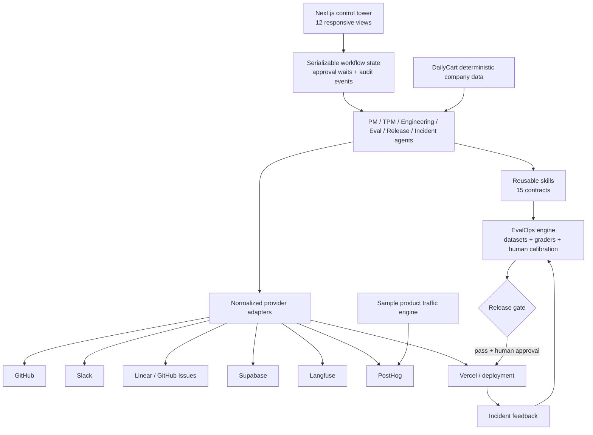

# V1 architecture diagram

```mermaid
flowchart TB
  UI[Next.js control tower\n12 responsive views] --> WF[Serializable workflow state\napproval waits + audit events]
  WF --> AG[PM / TPM / Engineering / Eval / Release / Incident agents]
  AG --> SK[Reusable skills\n15 contracts]
  SK --> EVAL[EvalOps engine\ndatasets + graders + human calibration]
  AG --> ADAPTERS[Normalized provider adapters]
  ADAPTERS --> GH[GitHub]
  ADAPTERS --> SL[Slack]
  ADAPTERS --> LI[Linear / GitHub Issues]
  ADAPTERS --> SB[Supabase]
  ADAPTERS --> LF[Langfuse]
  ADAPTERS --> PH[PostHog]
  ADAPTERS --> DEP[Vercel / deployment]
  DATA[DailyCart deterministic company data] --> AG
  TRAFFIC[Sample product traffic engine] --> PH
  EVAL --> GATE{Release gate}
  GATE -->|pass + human approval| DEP
  DEP --> INC[Incident feedback]
  INC --> EVAL
```
