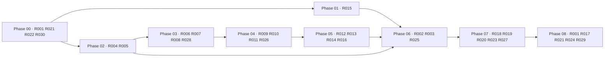

# Requirements-to-work graph

The stable requirement IDs below are the build graph. An arrow means the source requirement supplies an artifact or invariant needed by the target.

| Requirement | Producing work | Runtime consumer | Verification artifact |
|---|---|---|---|
| R001 | root scripts, lockfile, CI | fresh clone | `pnpm demo`, smoke test |
| R002–R003 | control-tower routes and lineage graph | reviewer | Playwright navigation and click-through |
| R004–R005 | company generator, schemas, validator | PM retrieval and data browser | determinism/reference tests |
| R006–R008 | PM ranker and approval state machine | TPM workflow | citation, scenario-change, pause/resume tests |
| R009–R011 | tracker/code-host adapters and delivery runner | two engineering workstreams | mock artifact plus executed tests |
| R012–R013 | eval engine, result store, release policy | release gate | blocked v1 and passing corrected v2 tests |
| R014–R016 | trace and analytics adapters, run telemetry | agent/eval pages | health/read model tests |
| R017 | incident-to-regression skill | eval dataset | lineage edge and rerun test |
| R018–R020 | Slack, tracker, database adapters | connected workflow | mock/live health contract tests |
| R021–R024 | secret scan, mode config, health checks, attribution | CI/setup | security and adapter tests |
| R025 | responsive app shell/pages | mobile reviewer | desktop/mobile Playwright projects |
| R026–R027 | parallel runner and deployment/code-host refs | lineage/release pages | distinct run IDs and external refs |
| R028 | reusable skill contracts | all agent roles | contract coverage tests/docs |
| R029 | exact manual checklist | operator | documentation review |
| R030 | adapter boundaries and onboarding ADR | V2 | architecture review |
